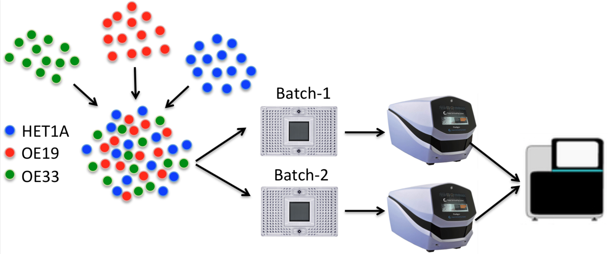

# Scasat (Single cell ATAC-seq analysis tool)
Scasat (single cell ATAC-seq analysis tool) is a complete pipeline to process single cell ATAC-seq data with simple steps. The pipeline is developed in a Jupyter notebook environment that holds the executable code along with the necessary description and results. For the initial sequence processing steps, the pipeline uses a number of well-known tools which it executes from a python environment for each of the fastq files. While functions for the data analysis part are mostly written in R.

## Prerequisites:

You have to have the following tools installed in the machine where you are running Scasat
1. [samtools](http://www.htslib.org)
2. [bedtools](http://bedtools.readthedocs.io/en/latest/)
3. [macs2](https://github.com/taoliu/MACS)
4. [bowtie2](http://bowtie-bio.sourceforge.net/bowtie2/index.shtml)
5. [picard](http://broadinstitute.github.io/picard/)
6. [trimmomatic](http://www.usadellab.org/cms/?page=trimmomatic)

If you have anaconda installed and using jupyter from anaconda then you can install the tools with the following anaconda commands
* samtools: conda install -c bioconda samtools
* bedtools: conda install -c bioconda bedtools 
* macs2: sudo apt install macs
* bowtie2: conda install -c bioconda bowtie2
* picard: conda install -c bioconda picard
* trimmomatic: conda install -c faircloth-lab trimmomatic

## Application: ##
Two notebooks to process two different datasets are provided here. 

### Deconvolute cell types ###

The objective of this experiment was to deconvolute the different cells from a complex mixture of cells.

__Experimental design:__

Two classic oesophageal adenocarcinoma (OAC) cell lines, OE19, OE33 and one non-neoplastic HET1A cell line were mixed together to create the complex mixture of population. These three cell lines were mixed at equal proportion to create this mixture. Single cell ATAC-seq was then performed on those two replicates by loading on two separate C1 fluidigm chips using a 96 well plate integrated fluidic circuit (IFC) and sequenced on an Illumina NextSeq. This experimental figure is shown in the figure below

### Public datatset: ###
Scasat is then applied to process and analyze the public dataset by [_Buenrostro et. al._](https://www.nature.com/articles/nature14590) and subsampled cells of [_Cusanovich et. al._](https://www.cell.com/cell/pdf/S0092-8674(18)30855-9.pdf)

## Publication
Pre-print related to Scasat can be accessed through this [link](https://www.biorxiv.org/content/early/2017/11/30/227397)
